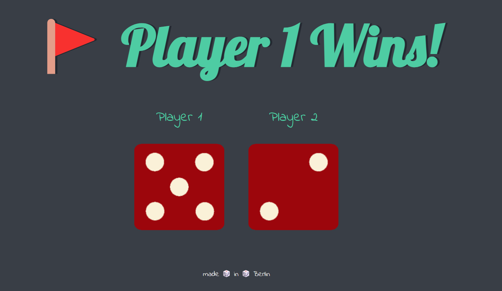

# Dice game

Dice game built using HTML, CSS & JS. 

## Tech Stack

- JavaScript ES6
- CSS
- HTML

## Demo

**Demo Link:** 
<a href ='https://varunthaker.github.io/Dice_game_L1/'>Demo here </a>

## Description

- It's a simple Dice game.
- On each refresh random number will be Drawn 
- Based on numbers on Dice Players (1 or 2) wins, or draws  

